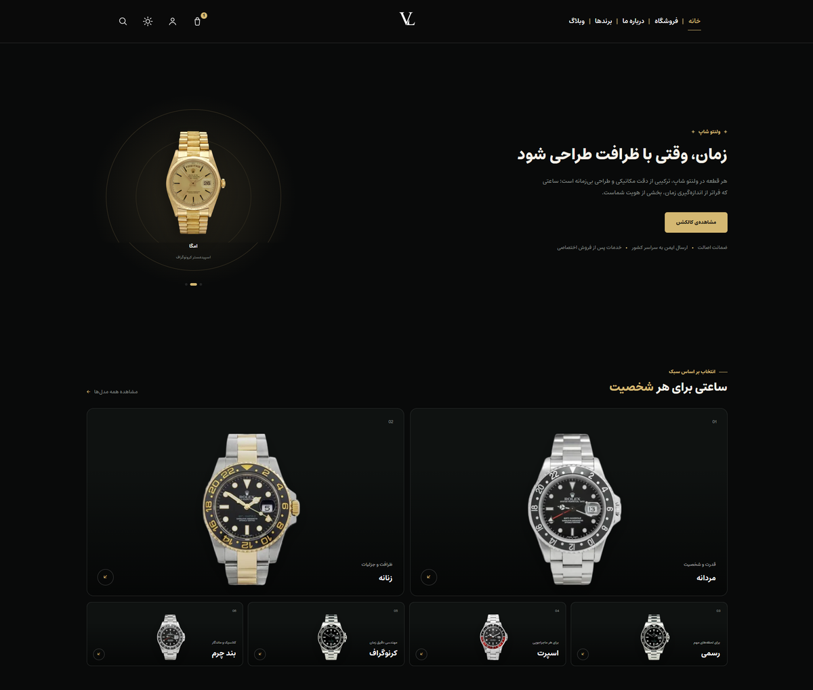

# Velento Shop



A luxury, RTL-first **WordPress / WooCommerce theme** for Persian watch stores.

**Live demo:** https://demo-velento.shop

## Features
- Full RTL and Persian typography (Estedad font)
- Slide-in cart drawer and login/register drawer
- SMS OTP login via Kavenegar
- Live search with recent searches and recently viewed products
- Brands, blog, about and shop pages
- Optional Elementor integration (22 custom widgets)
- Hardened AJAX endpoints: nonces, sanitization, rate limiting

## Tech stack
PHP 8.1+, WordPress 6+, WooCommerce, vanilla JavaScript, modular CSS.

## Installation
1. Download the latest ZIP from **Releases**.
2. WordPress admin -> Appearance -> Themes -> Add New -> Upload Theme.
3. Activate and install WooCommerce.

## SMS login setup (recommended)
Add this to `wp-config.php` so the key is never stored in the database:

```php
define('VELENTO_KAVENEGAR_API_KEY', 'your-key-here');
```

## Docs
See [`documentation/`](documentation) and [`docs/`](docs).

## Author
Made by [@geniusvl](https://github.com/geniusvl)

## License
GPL v2 or later. See [LICENSE.txt](LICENSE.txt).
